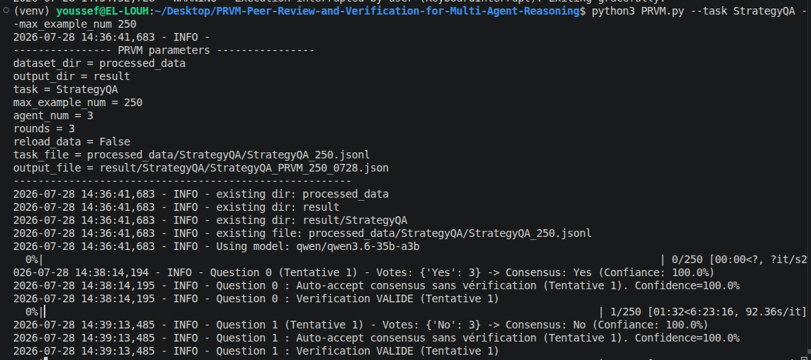
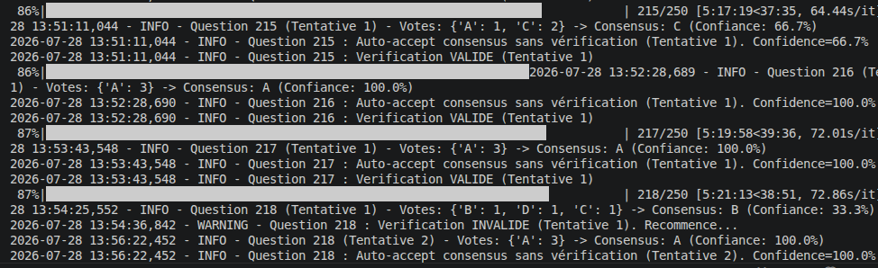
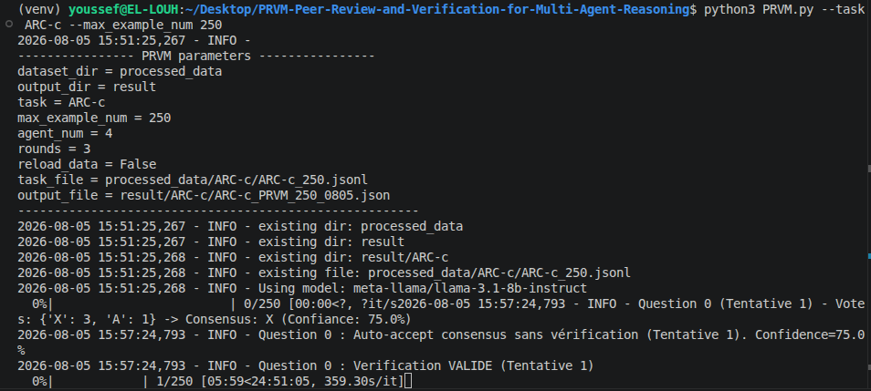

# 🚀 PRVM: Peer-Review and Verification for Multi-Agent Reasoning
## ✨ Overview

This repository contains the official implementation of the paper:

* Peer-Review and Verification for Multi-Agent Reasoning
## ✨ Overview

We introduce a multi-agent collaboration strategy that emulates the academic peer-review process. Each agent independently constructs its own solution, provides reviews of the solutions of others, and assigns confidence scores to its evaluations. Based on peer feedback, agents iteratively refine their initial solutions.

In addition, an Agent Verifier is incorporated into the framework. This verifier checks whether all reasoning steps in the final response are correct and logically consistent. If the solution is valid, it is approved as the final answer. Otherwise, the verifier returns the response along with a clear explanation of the errors detected  the first round, enabling further refinement and correction by the agents.
## 🏗️ Architecture & Baseline

Our framework is built around a **multi-agent reasoning system** inspired by the peer-review process in academic research.
### 📌 Baseline Methods

We compare our approach against several standard baselines:
- **Single-Agent Zero-shot Chain-of-Thought (CoT):** A single model directly generates the final answer without any external interaction or collaboration, relying solely on its internal reasoning process.
- **Self-consistency :** xploits the inherent randomness in LLMs by sampling multiple reasoning paths for the same user query. The final answer is derived by a majority voting.
- **Single-Agent Self-Correction:** A single model iteratively revises its own output by detecting and correcting errors across multiple refinement steps, aiming to progressively improve the final response.
- **Single-Agent Self-Critique:** A single model first produces an initial answer, then critically evaluates its own reasoning, identifies potential weaknesses, and uses this feedback to generate a more refined final answer.
- **Multi-Agent Debate:** Multiple agents collaboratively discuss a problem by exchanging arguments and counter-arguments in a structured debate setting, iteratively refining their responses through interaction.
- **Multi-Agent Feedback:** Multiple agents independently generate solutions and provide cross-feedback on each other’s outputs, improving reasoning quality through peer evaluation without using confidence scoring mechanisms.
---
# 📊 Dataset Classification 
This table summarizes commonly used datasets in AI evaluation, categorized by their primary role.
| Dataset | Primary Role | Link |
|--------|-------------|------|
| **MMLU** | General knowledge evaluation across multiple domains | [Hugging Face: cais/mmlu](https://huggingface.co/datasets/cais/mmlu) |
| **GSM8K** | Mathematical reasoning (grade-school arithmetic problems) | [Hugging Face: openai/gsm8k](https://huggingface.co/datasets/openai/gsm8k) |
| **StrategyQA** | Multi-step commonsense reasoning | [https://github.com](https://github.com/HITsz-TMG/Multi-agent-peer-review/tree/main/datasets) |
| **ARC-c** | Challenging scientific reasoning (question answering) | [Hugging Face: allenai/ai2_arc](https://huggingface.co/datasets/allenai/ai2_arc) |
---
## 📊 Metrics

We report the following evaluation metrics:

- **Accuracy (%)**: Measures the proportion of correctly predicted answers over the total number of samples. It reflects the overall performance of the system.

- **SEM (Standard Error of the Mean)**: Measures the uncertainty of the reported accuracy across samples.
  SEM is defined as:

  $$
  SEM = \frac{\sigma}{\sqrt{N}}
  $$

  where:
  - $\sigma$ is the standard deviation  
  - $N$ is the number of samples
- **Precision (%)**: Measures the proportion of correctly predicted labels among all predicted labels.

- **Recall (%)**: Measures the proportion of correctly predicted labels among all ground-truth labels.

- **F1-Score (%)**: Harmonic mean of precision and recall, providing a balanced evaluation.

- **Inference Time (mean, seconds,std)**: Average time required to generate a prediction.
- **Global Rectification Rate (GRR):** A crucial metric for evaluating the framework's self-correction capability. It measures the proportion of initially incorrect predictions that are successfully corrected in the final output. A higher GRR indicates a stronger ability of the framework to identify and rectify its own reasoning errors during the iterative reasoning process.
- **Valid Predictions**: Number of successfully parsed and valid predictions.
- **Invalid Predictions**: Number of failed or unparseable predictions.
##  Installation
Follow these steps to set up the project locally:
### 1. Clone the repository
```bash
    git clone https://github.com/youssefellouh/PRVM-Peer-Review-and-Verification-for-Multi-Agent-Reasoning.git
```

2. **Navigate to the project directory:**

    ```bash
    cd PRVM-Peer-Review-and-Verification-for-Multi-Agent-Reasoning
    ```

3. **Create a virtual environment:**

    ```bash
    python -m venv myenv
    ```

4. **Activate the virtual environment:**

    - On Windows:
    ```bash
      myenv\Scripts\activate
    ```
    - On Linux:
    ```bash
      source myenv/bin/activate
    ```

5. **Install the required dependencies:**

    ```bash
    pip install -r requirements.txt
    ```
## 🛠️ Data Processing

Preprocess and prepare any dataset before running experiments:

```bash
python data_proc.py --task <TASK_NAME> --max_example_num <MAX_NUM>
```
## 🚀 Run Experiments

```bash
python <SCRIPT_NAME>.py --task <TASK_NAME> --max_example_num <MAX_NUM>
```
---

## 📊 Evaluation

Evaluate model performance on the GSM8K dataset:

```bash
python3 eval.py --task <TASK_NAME> --method <METHOD_NAME> --time_flag <TIME_FLAG> --example_num <MAX_NUM>
```
### ⚙️ Configuration

The main experimental parameters, including:

- **`rounds`**: Number of rounds.
- **`agent_num`**: Number of collaborating agents.

are defined in the **`params.py`** file. Adjust these values before launching experiments according to your experimental setup.
## 📷 Example Outputs

The following examples illustrate the execution logs of **PRVM** on different benchmark datasets. They demonstrate the collaborative reasoning process, including agent voting, confidence estimation, automatic consensus, and verifier-based validation.

### Example 1 – StrategyQA (Qwen3.6-35B-A3B)



- **Number of agents:** 3
- **Number of rounds:** 3
- **Question:** 1
- The consensus is reached with a **confidence score of 100%**, and the answer is accepted directly.

### Example 2 – MMLU (Qwen3.6-35B-A3B)



- **Number of agents:** 3
- **Number of rounds:** 3
- **Question:** 218
- The initial verification is **invalid**, but after an additional verification attempt, the answer is successfully validated with a **confidence score of 100%**.

### Example 3 – ARC-c (Llama-3.1-8B-Instruct)



- **Number of agents:** 4
- **Number of rounds:** 3
- **Question:** 1
- No initial consensus is reached (**75% confidence**), requiring the verification stage before producing the final answer.
## Project Tree Overview
```bash
PRVM
├── .env.example                 # Example environment variables (API keys and configuration)
├── .gitignore                   # Files and directories ignored by Git
├── config.py                    # API configuration, model settings, and global constants
├── data_proc.py                 # Dataset preprocessing and sampling utilities
├── debate.py                    # Baseline: Multi-Agent Debate (MAD)
├── eval.py                      # Evaluation script for computing all performance metrics
├── evaluation_metrics.log       # Log file containing evaluation results
├── feedback.py                  # Baseline: Multi-Agent Feedback
├── image                        # Figures used in the README documentation
│   ├── consensus_4_Agent_ARC-c.png
│   ├── MMLU.png
│   └── StrategyQA.png
├── LICENSE                      # MIT license for the project
├── params.py                    # Experimental hyperparameters (number of agents, rounds, etc.)
├── processed_data               # Preprocessed benchmark datasets
│   ├── ARC-c
│   │   └── ARC-c_250.jsonl
│   ├── GSM8K
│   │   └── GSM8K_250.jsonl
│   ├── MMLU
│   │   └── MMLU_250.jsonl
│   └── StrategyQA
│       └── StrategyQA_250.jsonl
├── PRVM.py                      # Proposed PRVM framework 
├── PRVM_Without_Confidence.py   # Ablation study: PRVM without confidence estimation
├── PRVM_Without_Verifier.py     # Ablation study: PRVM without the verifier agent
├── README.md                    # Project documentation and usage instructions
├── requirements.txt             # Python dependencies
├── self_consistency.py          # Baseline: Self-Consistency reasoning
├── self_correction.py           # Baseline: Self-Correction reasoning
├── Self-Critique.py             # Baseline: Self-Critique reasoning
└── single_agent.py              # Baseline: CoT 
```

